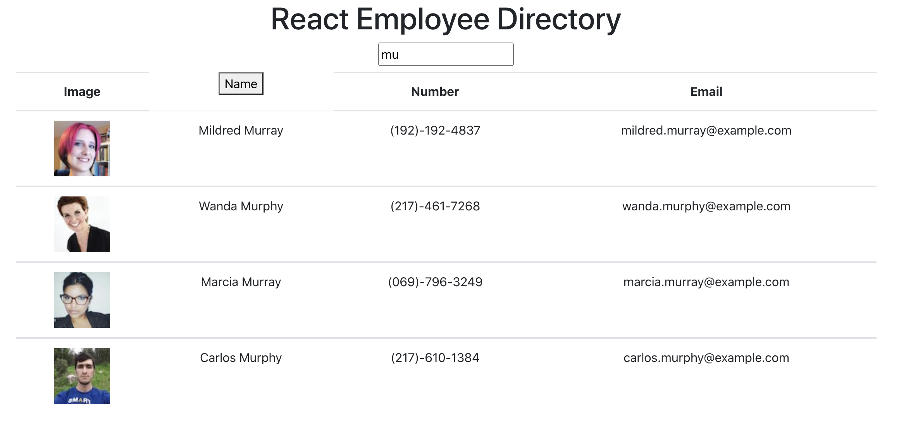

# ReactEmployeeDirectory

Table of Contents: |
------------- |
[Description](#description)|
[Installation](#installation)|
[Usage](#usage)|
[License](#license)|
[Contribution](#contribution)|
[Tests](#tests)|
[Questions](#questions)|

# Description
In this project, we used React.js to create an employee database table from an API resource.  You are able to sort by last name, as well as filter the search by last name.

# Installation
npm install

# Usage
This project would be good for a company to keep a catelogue of their employees.  Would need to add much security for working application.

# License
None

# Contribution
TeamWork

# Tests
None

# Questions
GitHub: Wolfdog27
If you have any additional questions please reach me at (https://github.com/Wolfdog27/) or e-mail me at KyleNicholasAnderson@gmail.com

